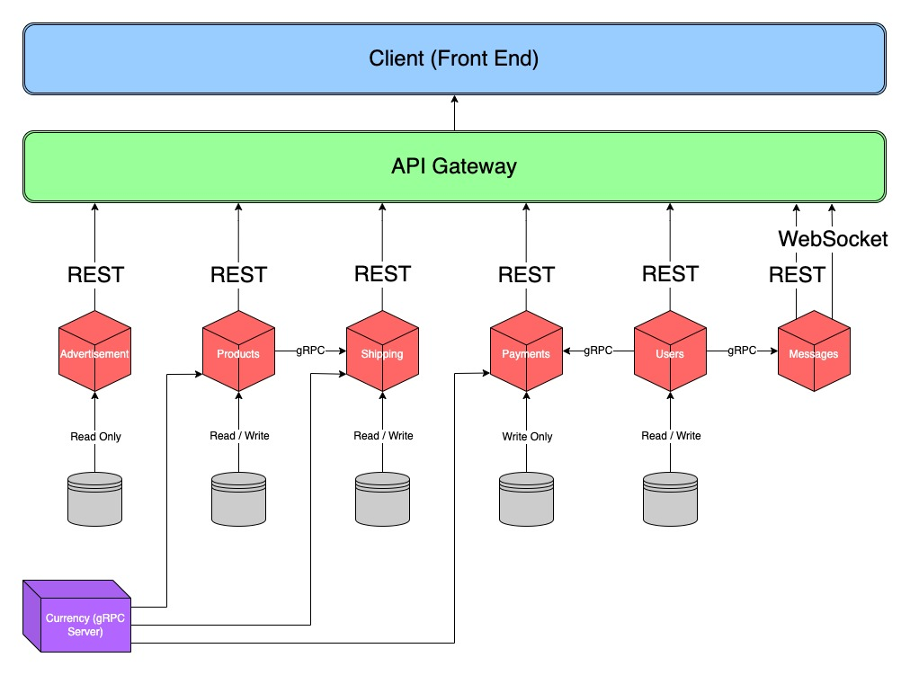

# PBay

An eBay clone, built with Go and React.

Goal is to implement microservices, rather than the monolithic approach that was taken for my other projects (TradingPlatform, etc.), as well as implement RPCs (gRPC)

## Dependencies
- Go
- (gRPC) Protocol buffer compiler (protoc)
- (gRPC) Plug-ins:
	- `go install google.golang.org/protobuf/cmd/protoc-gen-go@v1.28`
	- `go install google.golang.org/grpc/cmd/protoc-gen-go-grpc@v1.2`

## Usage
- To run the backend of the application, first clone the repository:
	- `git clone https://github.com/psebaraj/pbay.git`

- Navigate to the pBay directory

- (Re)make the protocall buffers for Go:
	- First update protoc plugin PATH: `export PATH="$PATH:$(go env GOPATH)/bin"`
	- Make all: `make protos`
	- Make specific XXX protobuf: `make protoXXX`

- Build and run the application:
	- `./start-pbay-backend.sh`

## Diagram

Microservices should only know email or address, and use RPC to retrieve the rest of the user's
	or address's data

## To-Do:
- [ ] Add Swagger
	- [x] products
	- [ ] users
	- [ ] messages
- [x] shell script for starting all services
- [ ] add /products?=....., deleteProduct, modifyProduct routes to products
- [ ] implement RPC
	- [x] user
	- [x] address
	- [x] currency
- [ ] create remaining microservices
	- [ ] shipping
	- [ ] payments
	- [ ] advertisements

## Contributor:
- [Patrick SebaRaj](https://github.com/PSebaRaj)
